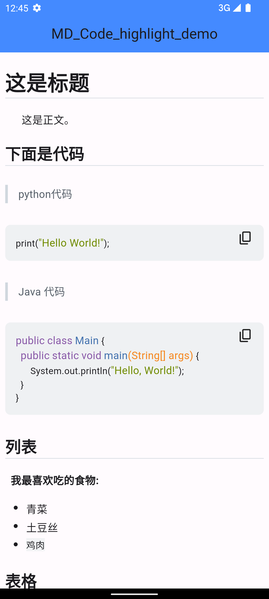

# MdCodeMath

&emsp;自己封装了一个 Markdown 文本渲染组件，支持：

- Markdown 语法渲染
- 代码高亮
- Latex 语法渲染
- 主题自适应

## 效果图

|       白天模式        |       黑夜模式        |
| :-------------------: | :-------------------: |
|  |  |
|           -           |           -           |
|  |  |
|           -           |           -           |
|  |  |

## 如何使用？

&emsp;pubspec.yaml 中添加下面的依赖：

- [markdown_widget](https://pub.dev/packages/markdown_widget)
- [flutter_math_fork](https://pub.dev/packages/flutter_math_fork)

&emsp;复制 component 下的三个文件到自己的项目中，需要渲染 Markdown
文本时，从`md_code_highlight_math.dart`中引入`MdCodeMath`使用。

&emsp;参考使用示例：

- [main.dart](https://github.com/NingNing0111/flutter-markdown-view/blob/master/lib/main.dart)
